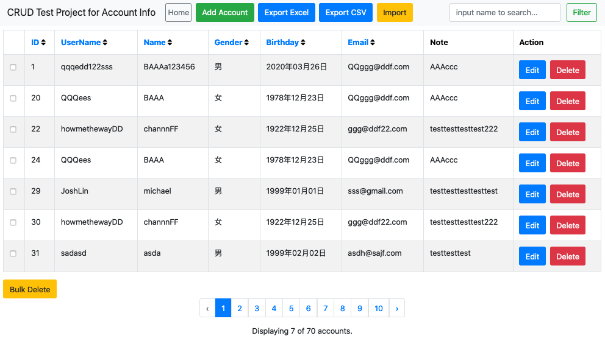

# CRUD 建構練習題

開發框架 Laravel 8.4

## 環境

- PHP 7.3
- composer 1.10.5
- git

## 套件

- maatwebsite/excel
- kyslik/column-sortable
- doctrine/dbal

## 操作環境還原步驟

### 下載原始碼

``git clone https://github.com/michael520/crud-homework.git``

### 安裝套件

``composer install``

### 修改 laravel 設定檔

``cp .env.example .env``

``vim .env``

````
  DB_CONNECTION=mysql
  DB_HOST=127.0.0.1
  DB_PORT=3306
  DB_DATABASE=laravel
  DB_USERNAME=root
  DB_PASSWORD=
````

### 產生亂數序號

``php artisan key:generate``

``vim .env``

````
  APP_KEY= the key here
````

### 遷移資料庫指令

``php artisan migrate``

### 啟動服務

``php artisan serve``

### 開啟瀏覽器，輸入網址

http://localhost:8000

### ScreenShot


